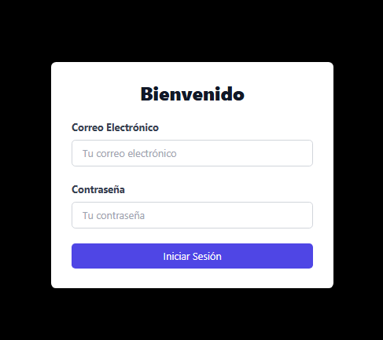
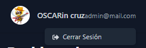
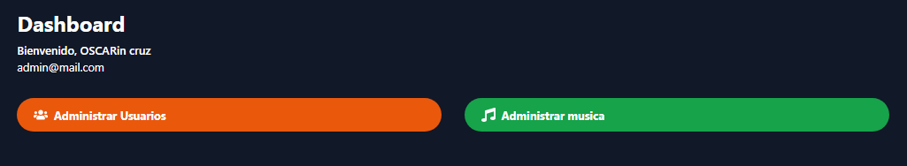

# Frontend de la API
BIEN aqui se detallara el proceso que se uso o como esta estructurado el proyecto del frontend de la api

## PROCEDIMIENTO

- **Autenticación de Usuarios**: Sistema de login y manejo de sesiones utilizando tokens.

- **ENVIRONMENT VARIABLES**: Se utilizara variables de entorno para poder identificar los tokens generados en el
                             NEXT_PUBLIC_API_URL=http://localhost:8000/api
                             NEXT_PUBLIC_MASTER_TOKEN=1|BAGMB7jlXOp9baUgavjMDEtc0HuYY6dtb85D7yV914f3a4c6

### Sistema de Autenticación
- Implementa un sistema de login seguro.
- Utiliza tokens  para manejar las sesiones de usuario.


## LOGIN 


```javascript
<form onSubmit={handleSubmit} className="space-y-6">
                    <div>
                        <label htmlFor="correoElectronico" className="block text-gray-700 font-bold mb-2">Correo Electrónico</label> {/* Added label */}
                        <input
                            id="correoElectronico"
                            name="correoElectronico"
                            type="email"
                            autoComplete="email"
                            required
                            className="w-full px-4 py-2 border border-gray-300 rounded-md focus:outline-none focus:ring-indigo-500 focus:border-indigo-500"
                            placeholder="Tu correo electrónico"
                            value={correoElectronico}
                            onChange={(e) => setCorreoElectronico(e.target.value)}
                        />
                    </div>
                    <div>
                        <label htmlFor="contraseña" className="block text-gray-700 font-bold mb-2">Contraseña</label> {/* Added label */}
                        <input
                            id="contraseña"
                            name="contraseña"
                            type="password"
                            autoComplete="current-password"
                            required
                            className="w-full px-4 py-2 border border-gray-300 rounded-md focus:outline-none focus:ring-indigo-500 focus:border-indigo-500"
                            placeholder="Tu contraseña"
                            value={contraseña}
                            onChange={(e) => setContraseña(e.target.value)}
                        />
                    </div>
```

### Dashboard
- Muestra información personalizada para el usuario autenticado.



```javascript
function Header() {
   const [isDropdownOpen, setIsDropdownOpen] = useState(false)
   const { user, logout } = useAuth()
   const dropdownRef = useRef(null)

   return (
       user && (
           <div ref={dropdownRef}>
               <button onClick={() => setIsDropdownOpen(!isDropdownOpen)}>
                   {user.url_imagenPerfil ?  : <FaUserCircle />}
               </button>
               {isDropdownOpen && (
                   <div>
                       <button onClick={logout}>
                           <FaSignOutAlt /> Cerrar Sesión
                       </button>
                   </div>
               )}
               <div>
                   <span>{user.nombre} {user.apellido}</span>
                   <span>{user.correo_electronico}</span>
               </div>
           </div>
       )
   )
}
```


- Incluye nuestras 2 tablas de gestion tanto de usuarios como de canciones.




``` javascript
<Header />
            <main className="max-w-7xl mx-auto p-6 space-y-8"> {/* Improved main section */}
                <section className="flex items-center justify-between">
                    <div>
                        <h1 className="text-3xl font-bold mb-2">Dashboard</h1>
                        {user && (
                            <div>
                                <p className="font-medium">
                                    Bienvenido, {user.nombre} {user.apellido}
                                </p>
                                <p>{user.correo_electronico}</p>
                            </div>
                        )}
                    </div>
                </section>

                <section className="grid grid-cols-1 md:grid-cols-2 gap-8"> {}
                    <Link
                        href="/usuarios"
                        className="bg-orange-600 hover:bg-orange-700 text-white font-bold py-3 px-6 rounded-full flex items-center space-x-2 transition duration-300 ease-in-out transform hover:scale-105"
                    >
                        <FaUsers className="text-xl" />
                        <span>Administrar Usuarios</span>
                    </Link>
                    <Link
                        href="/musica"
                        className="bg-green-600 hover:bg-green-700 text-white font-bold py-3 px-6 rounded-full flex items-center space-x-2 transition duration-300 ease-in-out transform hover:scale-105"
                    >
                        <FaMusic className="text-xl" />
                        <span>Administrar musica</span>
                    </Link>
                </section>
            </main>
        </div>
        ```

### GESTION DE CANCIONES
- Permite agregar nuevos usuarios con un formulario interactivo.
- Ofrece la capacidad de editar información de usuarios existentes.
- Implementa validación de formularios y manejo de errores.

## Capturas de Pantalla

