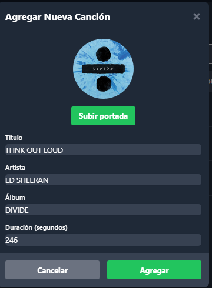
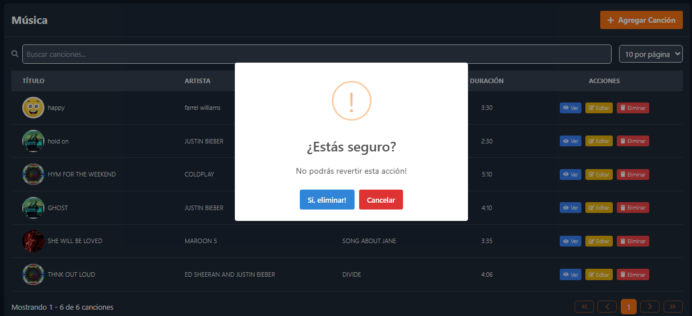
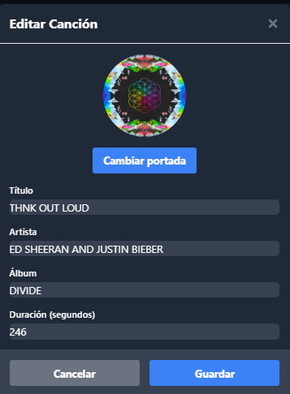
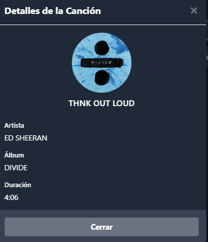

# Frontend de la API
BIEN aqui se detallara el proceso que se uso o como esta estructurado el proyecto del frontend de la api

## PROCEDIMIENTO

- **Autenticación de Usuarios**: Sistema de login y manejo de sesiones utilizando tokens.

- **ENVIRONMENT VARIABLES**: Se utilizara variables de entorno para poder identificar los tokens generados en el
                             NEXT_PUBLIC_API_URL=http://localhost:8000/api
                             NEXT_PUBLIC_MASTER_TOKEN=1|BAGMB7jlXOp9baUgavjMDEtc0HuYY6dtb85D7yV914f3a4c6

### Sistema de Autenticación
- Implementa un sistema de login seguro.
- Utiliza tokens  para manejar las sesiones de usuario.


## LOGIN 


```javascript
<form onSubmit={handleSubmit} className="space-y-6">
                    <div>
                        <label htmlFor="correoElectronico" className="block text-gray-700 font-bold mb-2">Correo Electrónico</label> {/* Added label */}
                        <input
                            id="correoElectronico"
                            name="correoElectronico"
                            type="email"
                            autoComplete="email"
                            required
                            className="w-full px-4 py-2 border border-gray-300 rounded-md focus:outline-none focus:ring-indigo-500 focus:border-indigo-500"
                            placeholder="Tu correo electrónico"
                            value={correoElectronico}
                            onChange={(e) => setCorreoElectronico(e.target.value)}
                        />
                    </div>
                    <div>
                        <label htmlFor="contraseña" className="block text-gray-700 font-bold mb-2">Contraseña</label> {/* Added label */}
                        <input
                            id="contraseña"
                            name="contraseña"
                            type="password"
                            autoComplete="current-password"
                            required
                            className="w-full px-4 py-2 border border-gray-300 rounded-md focus:outline-none focus:ring-indigo-500 focus:border-indigo-500"
                            placeholder="Tu contraseña"
                            value={contraseña}
                            onChange={(e) => setContraseña(e.target.value)}
                        />
                    </div>
```

### Dashboard
- Muestra información personalizada para el usuario autenticado.


```javascript
function Header() {
   const [isDropdownOpen, setIsDropdownOpen] = useState(false)
   const { user, logout } = useAuth()
   const dropdownRef = useRef(null)

   return (
       user && (
           <div ref={dropdownRef}>
               <button onClick={() => setIsDropdownOpen(!isDropdownOpen)}>
                   {user.url_imagenPerfil ?  : <FaUserCircle />}
               </button>
               {isDropdownOpen && (
                   <div>
                       <button onClick={logout}>
                           <FaSignOutAlt /> Cerrar Sesión
                       </button>
                   </div>
               )}
               <div>
                   <span>{user.nombre} {user.apellido}</span>
                   <span>{user.correo_electronico}</span>
               </div>
           </div>
       )
   )
}
```


- Incluye nuestras 2 tablas de gestion tanto de usuarios como de canciones.


``` javascript
            <Header />
            <main className="max-w-7xl mx-auto p-6 space-y-8"> {/* Improved main section */}
                <section className="flex items-center justify-between">
                    <div>
                        <h1 className="text-3xl font-bold mb-2">Dashboard</h1>
                        {user && (
                            <div>
                                <p className="font-medium">
                                    Bienvenido, {user.nombre} {user.apellido}
                                </p>
                                <p>{user.correo_electronico}</p>
                            </div>
                        )}
                    </div>
                </section>

                <section className="grid grid-cols-1 md:grid-cols-2 gap-8"> {}
                    <Link
                        href="/usuarios"
                        className="bg-orange-600 hover:bg-orange-700 text-white font-bold py-3 px-6 rounded-full flex items-center space-x-2 transition duration-300 ease-in-out transform hover:scale-105"
                    >
                        <FaUsers className="text-xl" />
                        <span>Administrar Usuarios</span>
                    </Link>
                    <Link
                        href="/musica"
                        className="bg-green-600 hover:bg-green-700 text-white font-bold py-3 px-6 rounded-full flex items-center space-x-2 transition duration-300 ease-in-out transform hover:scale-105"
                    >
                        <FaMusic className="text-xl" />
                        <span>Administrar musica</span>
                    </Link>
                </section>
            </main>
        </div>       
```


### GESTION DE CANCIONES
 - Incluye la tabla de gestion de canciones con los campos correspondientes.


```javascript

<table className="w-full">
    <thead>
        <tr className="bg-gray-700 text-gray-200 uppercase text-sm leading-normal">
            <th className="py-3 px-6 text-left">Título</th>
            <th className="py-3 px-6 text-left">Artista</th>
            <th className="py-3 px-6 text-left">Álbum</th>
            <th className="py-3 px-6 text-center">Duración</th>
            <th className="py-3 px-6 text-center">Acciones</th>
        </tr>
    </thead>
    <tbody className="text-gray-200 text-sm font-light">
        {cancionesActuales.map((cancion) => (
            <tr key={cancion.id} className="border-b border-gray-700 hover:bg-gray-600">
                <td className="py-3 px-6 text-left whitespace-nowrap">
                    <div className="flex items-center">
                        <div className="mr-2">
                            {cancion.cover_art_url ? (
                                
                            ) : (
                                <div className="w-12 h-12 rounded-full bg-gray-600 flex items-center justify-center">
                                    <span className="text-gray-200 font-medium">{cancion.title[0]}</span>
                                </div>
                            )}
                        </div>
                        <span>{cancion.title}</span>
                    </div>
                </td>
                <td className="py-3 px-6 text-left">{cancion.artist}</td>
                <td className="py-3 px-6 text-left">{cancion.album}</td>
                <td className="py-3 px-6 text-center">{Math.floor(cancion.duration / 60)}:{(cancion.duration % 60).toString().padStart(2, '0')}</td>
                <td className="py-3 px-6 text-center">
                    <div className="flex items-center justify-center gap-2">
                        <button
                            className="bg-blue-500 hover:bg-blue-600 text-white px-2 py-1 rounded text-xs flex items-center"
                            onClick={() => {
                                setCancionSeleccionada(cancion)
                                setMostrarVerCancion(true)
                            }}
                        >
                            <FaEye className="mr-1" />
                            Ver
                        </button>
                        <button
                            className="bg-yellow-500 hover:bg-yellow-600 text-white px-2 py-1 rounded text-xs flex items-center"
                            onClick={() => {
                                setCancionSeleccionada(cancion)
                                setMostrarEditarCancion(true)
                            }}
                        >
                            <FaEdit className="mr-1" />
                            Editar
                        </button>
                        <button
                            className="bg-red-500 hover:bg-red-600 text-white px-2 py-1 rounded text-xs flex items-center"
                            onClick={() => handleEliminarCancion(cancion)}
                        >
                            <FaTrash className="mr-1" />
                            Eliminar
                        </button>
                    </div>
                </td>
            </tr>
        ))}
    </tbody>
</table>
```

## MODALES PARA LAS ACCIONES

 - Incluye el boton de agregar canciones.




```javascript
interface Cancion {
    title: string
    artist: string
    album: string
    duration: number
}

interface AgregarCancionProps {
    onClose: () => void
    onAdd: (newCancion: Cancion) => void
}

export default function AgregarCancion({ onClose, onAdd }: AgregarCancionProps) {
    const [formData, setFormData] = useState({
        title: '',
        artist: '',
        album: '',
        duration: 0
    })

    const handleChange = (e: React.ChangeEvent<HTMLInputElement>) => {
        const { name, value } = e.target
        setFormData(prev => ({ ...prev, [name]: value }))
    }

    const handleSubmit = (e: React.FormEvent) => {
        e.preventDefault()
        onAdd(formData) // Agrega la canción
        onClose() // Cierra el formulario
    }
```


 - Incluye el boton de eliminar canciones.

 
```javascript

 const handleEliminarCancion = async (cancion: Cancion) => {
        try {
            const result = await MySwal.fire({
                title: '¿Estás seguro?',
                text: "No podrás revertir esta acción!",
                icon: 'warning',
                showCancelButton: true,
                confirmButtonColor: '#3085d6',
                cancelButtonColor: '#d33',
                confirmButtonText: 'Sí, eliminar!',
                cancelButtonText: 'Cancelar'
            })

            if (result.isConfirmed) {
                const response = await fetch(`${process.env.NEXT_PUBLIC_API_URL}/musica/${cancion.id}`, {
                    method: 'DELETE',
                    headers: {
                        'Authorization': `Bearer ${localStorage.getItem('auth_token')}`
                    }
                })

                if (!response.ok) {
                    throw new Error('Error al eliminar la canción')
                }

                await fetchCanciones() // Recargar la lista después de eliminar
                MySwal.fire(
                    'Eliminada!',
                    'La canción ha sido eliminada.',
                    'success'
                )
            }
        } catch (error) {
            console.error('Error:', error)
            MySwal.fire({
                icon: 'error',
                title: 'Error',
                text: 'No se pudo eliminar la canción. Por favor, intente de nuevo.',
            })
        }
    }
```

 - Incluye el boton de editar canciones.

 

```javascript

 {mostrarEditarCancion && cancionSeleccionada && (
                <EditarCancion
                    cancion={cancionSeleccionada}
                    onClose={() => {
                        setMostrarEditarCancion(false)
                        setCancionSeleccionada(null)
                    }}
                    onUpdate={async () => {
                        await fetchCanciones()
                        setMostrarEditarCancion(false)
                        setCancionSeleccionada(null)
                    }}
                />
            )}


              const updatedCancion = await response.json()
            onUpdate(updatedCancion)
            MySwal.fire({
                icon: 'success',
                title: 'Éxito',
                text: 'Canción actualizada correctamente',
            })
        } catch (error) {
            console.error('Error al actualizar canción:', error)
            MySwal.fire({
                icon: 'error',
                title: 'Error',
                text: 'No se pudo actualizar la canción. Por favor, intente de nuevo.',
            })
        }
    }
```


  - Incluye el boton de ver canciones.

  


ESTA PARTE ES DENTRO DE LA TABLA DE CANCIONES
 ```javascript
  {mostrarVerCancion && cancionSeleccionada && (
                <VerCancion
                    cancion={cancionSeleccionada}
                    onClose={() => {
                        setMostrarVerCancion(false)
                        setCancionSeleccionada(null)
                    }}
                />
            )}
```


 ESTA PARTE ES DE LA VENTANA MODAL
 ```javascript
<div className="p-4">
                    <div className="flex flex-col items-center mb-6">
                        {cancion.cover_art_url ? (
                            
                        ) : (
                            <div className="w-32 h-32 rounded-full bg-gray-200 flex items-center justify-center mb-2">
                                <FaMusic className="w-16 h-16 text-gray-400" />
                            </div>
                        )}
                        <h3 className="text-lg font-semibold text-white">{cancion.title}</h3>
                    </div>
                    <div className="space-y-4">
                        <div>
                            <label className="block text-sm font-medium text-white">Artista</label>
                            <p className="mt-1 text-white">{cancion.artist}</p>
                        </div>
                        <div>
                            <label className="block text-sm font-medium text-white">Álbum</label>
                            <p className="mt-1 text-white">{cancion.album}</p>
                        </div>
                        <div>
                            <label className="block text-sm font-medium text-white">Duración</label>
                            <p className="mt-1 text-white">{Math.floor(cancion.duration / 60)}:{(cancion.duration % 60).toString().padStart(2, '0')}</p>
                        </div>
                    </div>

 ```

## CONCLUSION
ES UNA MUY BUENA PRACTICA TAL VEZ SE PUEDE MEJORAR PERO EN TERMINOS CLAROS MUY BUENA OBIVIAMENTE EL DISENO NOS FALTA MEJORAR MUCHO
PERO LA FUNCIONALIDAD ES CORRECTA Y ES MUY INTERESANTE LA MANERA EN QUE SE MANEJAN LAS PAGINAS WEB EN GENERAL